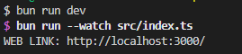
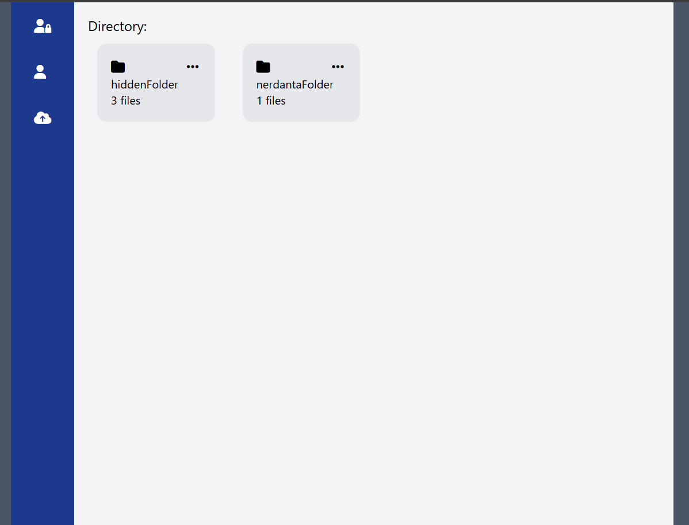
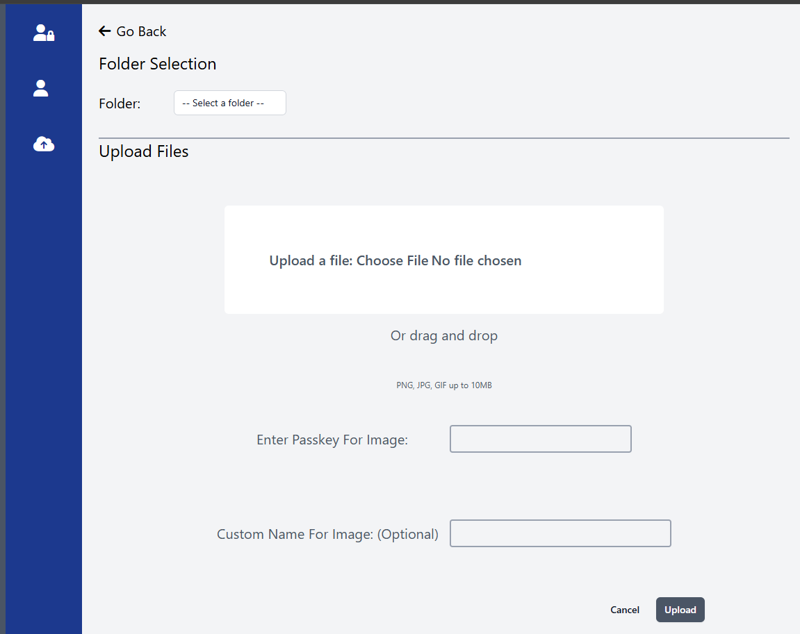
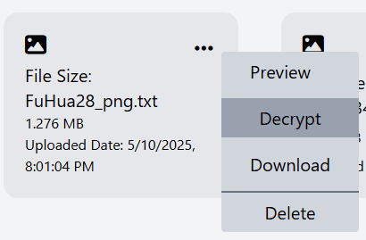
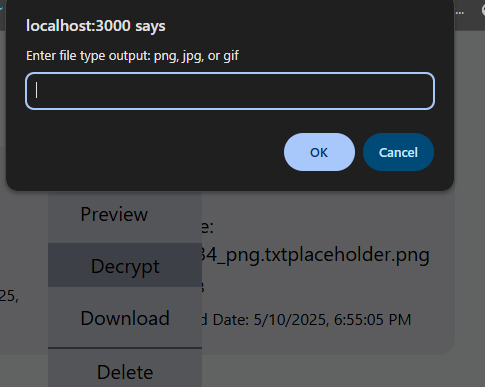
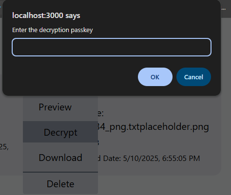
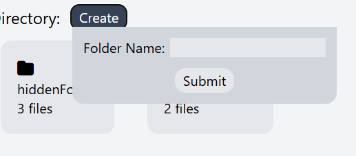

# Introduction 
This is a Typescript-based encryption functions repository created with the JavaScript runtime Bun. The main objective of this code is to create an API to encrypt mainly image or text into an AES-256 format with a passkey to encrypt. This was done mainly possible due to the crypto libraries Bun provided and file system. 🔐🗃

## Side Note
This was mainly a hobby for me and I only do this for fun. The current design is only for personal use at the moment. 💫💫

# Installation
## Runtime
1. Ensure you have the latest Bun installed (Version: 1.2.5+ or Above, you're able to check your Bun version if you have one via) 😃
```
bun --version
```
### If you haven't had Bun install, you're able to [Bun.sh](https://bun.sh/) to install it.

2. Once you have ensure the latest Bun is installed, head to the main page and install all the neccesary Bun package there. 🥚
```
bun i 
```
### The only library we have used so far are just the Bun, Typescript and Dotenv.

3. Once all neccesary libraries are installed, head to your server and run the main index.ts inside src by watch. 

```
bun run dev
```

4. It'll show you a web url with the localhost running on port 3000 by default(You can customize the port in .env file). Click or use the url as provided and you'll be lead to the webiste

```
http://localhost:3000/
```


### ⚠ WORK IN PROGRESS 🔨

## OPTIONAL ENV
1. If you want to configure your hosting port, you can set it up in the .env prop file.

Terminal:
```
mkdir .env
```

.env:
```
PORT = 8000 
```

index.ts:
```
const key = process.env.SECRET_KEY
```

### MORE WORK IN PROGRESS 🎞

| Plans  | Status |
| ------------- | ------------- |
| Upload Image  | ✅ |
| Multi Uplaod  | ❌ |
| Image Preview  | ✅ |
| Decrypt Image  | ✅ |
| Encrypt Image  | ❌ |
| Create Folder  | ✅ |
| Multi Decrypt  | ❌ |
| Multi Encrypt  | ❌ |
| Stability  | ❌ |

## Plan in Future:
# Interface
- I plan to actually separate the UI and server because I find it difficult to develop UI in backend, I should've vite react on client.

# Server
- I need to rework the functions etc because I realize how most of them are inconsistent as some for example utilize full directory while some separate the directory name like "./storage" + "/folder" + "/filename".
- Also I need to rework the paramter and return of functions, instead of multiple argument, I should've use object and return an object too. It should make thing more simplier and consistent.
- Since the project is localhosted as planned, I didn't really plan out a database but I realize how troublesome it is to keep track of passkey and file information with just local storage. In the future, I plan to implement SQLite so a database to meta link database with folder while keeping the localhosting benefit.


### Expected Interface (Work in Progress 🔨 ding ding)


## Current Feature:
1. Upload Image
- Ensure you select a folder before you upload one and make sure you remember your passkey. 🎇


2. Preview Image 
- You can now preview an image that has been decrypted, a locked image won't be preview at the moment.


3. Decrypt Image 
- You can now decrypt an image that has been locked, at the moment, we only utilizes HTML confirm() and alert() as I regret writing TSX in the backend.
- First decrypt a locked image, they are txt folder 99% of the time, I plan to change this in the future

- A HTML form will appear on top and you'll have to type in the format output.

- Then you'll have to pass in the exact passkey to decrypt your image, at the moment it's a little buggy as I realize how bad I am at writing normal DOM javascript 💀


4. Create Folder
- You can create your own directory at the main page and set it to whatever name you want. The UI look terrible at the moment, I'll try to fix it in the future.



## Feature work in progress:
1. Decrypt multiple images in folder
2. Upload multiple images
3. Encrypt image manually
4. Debugging known bugs